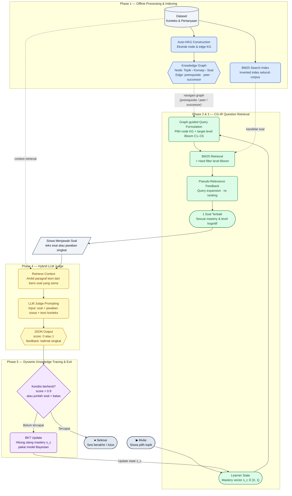

## ⚙️ System Pipeline Architecture (CG-IR & Hybrid LLM Judge)

Karena dataset bank soal tidak memiliki kunci jawaban, sistem menggunakan pendekatan **Hybrid Context-Retrieval LLM Judge**. Sistem akan mencari materi teori yang relevan secara real-time untuk dijadikan "buku panduan" bagi LLM saat mengoreksi jawaban siswa.



# Auto-HKG 
**Automated Hierarchical Knowledge Graph Constructor**

Implementasi modul Auto-HKG dari paper:
> *"Beyond Static Question Banks: Dynamic Knowledge Expansion via LLM-Automated Graph Construction and Adaptive Generation"* (Wang et al., 2026)

Diadaptasi untuk dataset Geografi/IPS SMA dengan pipeline **CG-IR** (pengganti RAG) untuk final project mata kuliah **Information Retrieval**.

---

## Struktur Proyek

```
auto-hkg/
├── src/
│   ├── auto_hkg.py          # pipeline utama
│   ├── llm_client.py        # abstraksi provider LLM
│   ├── schema_validator.py  # validasi output JSON
│   ├── graph_builder.py     # perakitan graph (NetworkX)
│   └── visualize_graph.py   # visualisasi PNG & HTML
├── data/
│   └── Knowledge_Base_Update.csv
├── output/
│   ├── graph/               # hasil: .json, .csv, .png, .html
│   └── logs/                # checkpoint & log
├── notebooks/
│   └── Auto_HKG_Colab.ipynb
├── requirements.txt
└── README.md
```


