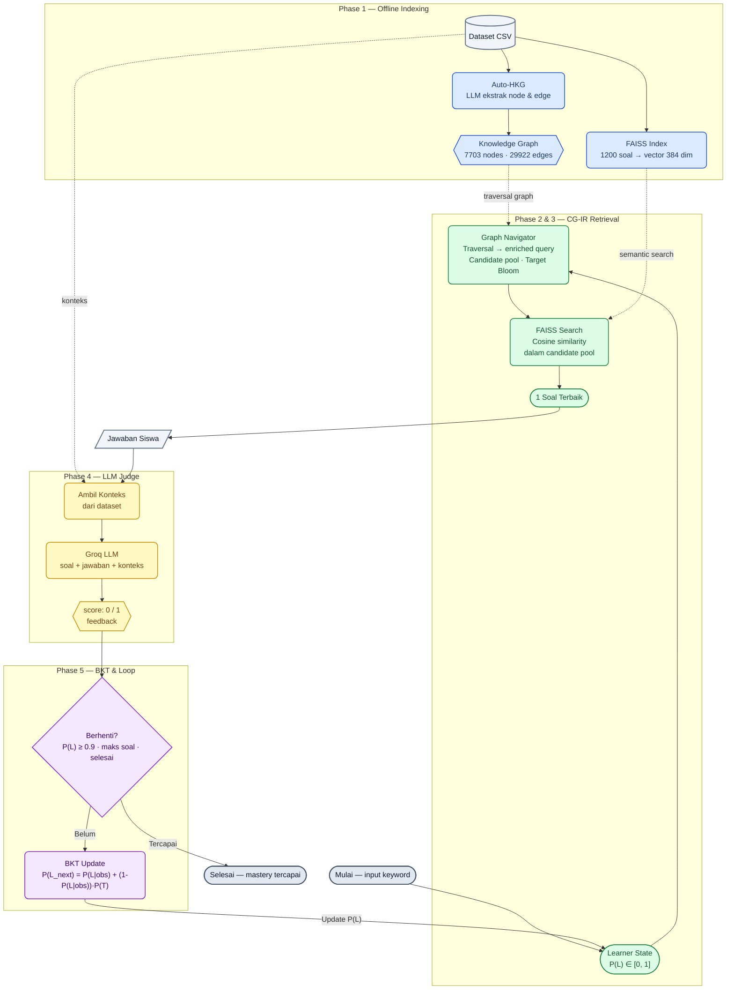

# CG-IR Adaptive Quiz System

**Context-Guided Information Retrieval: Knowledge Graph + FAISS Dense Retrieval**

Final Project — Mata Kuliah Information Retrieval

---

## Overview

Sistem adaptive quiz yang secara otomatis menyesuaikan soal berdasarkan tingkat penguasaan (mastery) siswa. Sistem menggunakan **CG-IR** (Context-Guided Information Retrieval) yang menggabungkan Knowledge Graph sebagai navigator topik dengan FAISS sebagai semantic search engine.

Karena dataset tidak memiliki kunci jawaban, sistem menggunakan **Hybrid Context-Retrieval LLM Judge** — LLM menilai jawaban siswa menggunakan konteks teori dari dataset sebagai referensi.

---

## System Pipeline


---

## Cara Kerja CG-IR

### Masalah yang Diselesaikan

Sistem retrieval biasa (FAISS tanpa graph) mencari soal dari seluruh corpus berdasarkan kemiripan semantik saja, tanpa mempertimbangkan:
- Apakah topik soal sesuai dengan yang diminta user
- Apakah level kognitif soal sesuai dengan mastery user saat ini

CG-IR menyelesaikan ini dengan dua kontribusi graph:

### Kontribusi 1 — Query Enrichment

Ketika user mengetik keyword `"pancasila"`, GraphNavigator menelusuri graph dan mengumpulkan label semua node yang terhubung:

```
Keyword: "pancasila"

Node yang ditemukan:
  topic_coarse : "Pancasila dan Kebijakan"
  topic_fine   : "Nilai-nilai Pancasila"
  concept      : "Sila Pertama"
  concept      : "Ideologi Negara"

Enriched query:
  "pancasila Pancasila dan Kebijakan Nilai-nilai Pancasila Sila Pertama Ideologi Negara"
```

Query yang diperkaya ini di-encode oleh sentence-transformer menjadi vector yang merepresentasikan konteks topik lebih kaya, sehingga FAISS lebih mudah menemukan soal yang benar-benar relevan.

### Kontribusi 2 — Candidate Pool

GraphNavigator mengumpulkan question node IDs yang terhubung ke topik via edge `has_question`. FAISS kemudian hanya mencari di dalam pool tersebut:

```
Tanpa graph: FAISS search di 1200 soal → bisa dapat soal apapun
Dengan graph: FAISS search di ~15 soal terkait "pancasila" → lebih terfokus
```

### Adaptive Traversal

Arah traversal graph menyesuaikan mastery:

```
mastery rendah (< 0.5) → ikuti prerequisite edges → soal lebih mudah
mastery sedang         → ikuti peer edges → soal setara
mastery tinggi (>= 0.5) → ikuti successor edges → soal lebih sulit
```

---

## Komponen Sistem

### Knowledge Graph (Auto-HKG)

Dibangun secara otomatis dari dataset menggunakan LLM. Graph berisi:

| Node Type | Contoh | Jumlah |
|---|---|---|
| topic_coarse | "Pelestarian Lingkungan" | 367 |
| topic_fine | "Pelestarian Sumber Daya Air" | 1070 |
| concept | "Siklus Hidrologi" | 5005 |
| question | "Jelaskan proses siklus hidrologi!" | 1200 |
| method | "C4-Menganalisis" | 61 |

| Edge Type | Arah | Fungsi |
|---|---|---|
| has_subtopic | topic_coarse → topic_fine | Hierarki topik |
| has_concept | topic_fine → concept | Hierarki konsep |
| has_question | topic/concept → question | Menghasilkan candidate pool |
| prerequisite | topic → topic | Navigasi ke topik lebih mudah |
| peer | topic → topic | Navigasi ke topik setara |
| successor | topic → topic | Navigasi ke topik lebih sulit |
| requires_method | question → method | Metadata Bloom (tidak dipakai retrieval) |

### FAISS Dense Retrieval

Model: `paraphrase-multilingual-MiniLM-L12-v2`
- Mendukung Bahasa Indonesia
- Dimensi vector: 384
- Ukuran model: ~120MB
- Tidak butuh GPU

Setiap soal di-encode menjadi vector yang merepresentasikan makna semantiknya. Pencarian dilakukan dengan cosine similarity.

### Bayesian Knowledge Tracing (BKT)

Melacak mastery user per konsep menggunakan model probabilistik:

```
P(L_next) = P(L|obs) + (1 - P(L|obs)) × P(T)

Parameter:
  p_init    = 0.10   prior mastery sebelum mulai
  p_transit = 0.05   kemungkinan belajar dari satu soal
  p_slip    = 0.15   kemungkinan tahu tapi jawab salah
  p_guess   = 0.25   kemungkinan tidak tahu tapi jawab benar
```

### LLM Judge

Model: `llama-3.3-70b-versatile` via Groq API (free tier)

Input: soal + jawaban user + konteks teori dari dataset
Output: `{"score": 0|1, "feedback": "kalimat penjelasan"}`

---

## Project Structure

```
cg_ir/
├── src/
│   ├── data_loader.py           # Load CSV + graph, link corpus ke graph
│   ├── retrieval/
│   │   ├── __init__.py
│   │   ├── faiss_index.py       # FAISS dense retrieval index
│   │   ├── graph_navigator.py   # KG traversal + query formulation
│   │   └── cgir_pipeline.py     # Pipeline utama + FAISSBaseline
│   ├── tracing/
│   │   ├── __init__.py
│   │   └── bkt.py               # Bayesian Knowledge Tracing
│   ├── judge/
│   │   ├── __init__.py
│   │   └── llm_judge.py         # LLM answer judge + relevance judge
│   └── evaluation/
│       ├── __init__.py
│       ├── metrics.py           # P@k, R@k, NDCG@k, MRR, MAP, Bloom accuracy
│       └── benchmark.py         # CG-IR vs FAISS baseline comparison
├── notebooks/
│   └── CG_IR_Pipeline.ipynb
├── requirements.txt
└── README.md
```
---

## Evaluation Metrics

| Metrik | Keterangan | Butuh Ground Truth |
|---|---|---|
| P@k | Precision at k | Ya |
| R@k | Recall at k | Ya |
| NDCG@k | Normalized Discounted Cumulative Gain | Ya (graded) |
| MRR | Mean Reciprocal Rank | Ya |
| MAP | Mean Average Precision | Ya |
| Bloom Accuracy | % soal dengan Bloom level tepat | Tidak |
| Bloom MAE | Rata-rata selisih Bloom level | Tidak |
| Latency | Waktu retrieval per query (mean + P95) | Tidak |

Relevance judgments dibuat menggunakan LLM judge (Groq) dengan skala 0–3, dijalankan sekali dan disimpan ke JSON untuk reuse.

---

## Hasil Evaluasi

| Metrik | FAISS Baseline | CG-IR (Graph + FAISS) |
|---|---|---|
| Bloom Accuracy | 28.6% | 57.1% |
| Bloom MAE | 0.714 | 0.429 |
| Graph Coverage | 0% | 100% |

CG-IR mengungguli FAISS baseline secara signifikan pada Bloom accuracy — metrik yang paling relevan untuk sistem adaptive learning karena mengukur ketepatan level kognitif soal terhadap mastery user. FAISS baseline unggul pada pure relevance metrics (P@k, NDCG@k) karena bebas mencari di seluruh corpus tanpa pembatasan candidate pool dari graph.

---

## Dependencies

```
faiss-cpu>=1.7.4
sentence-transformers>=2.6.0
networkx>=3.2
numpy>=1.24
pandas>=2.0
tqdm>=4.65
groq>=0.11.0
matplotlib>=3.7
tabulate>=0.9.0
```
